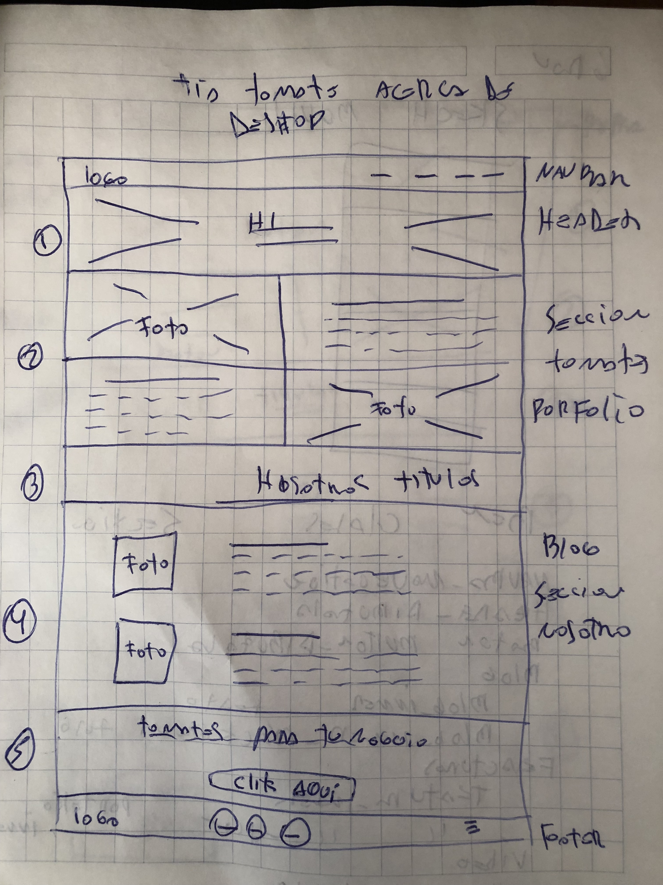
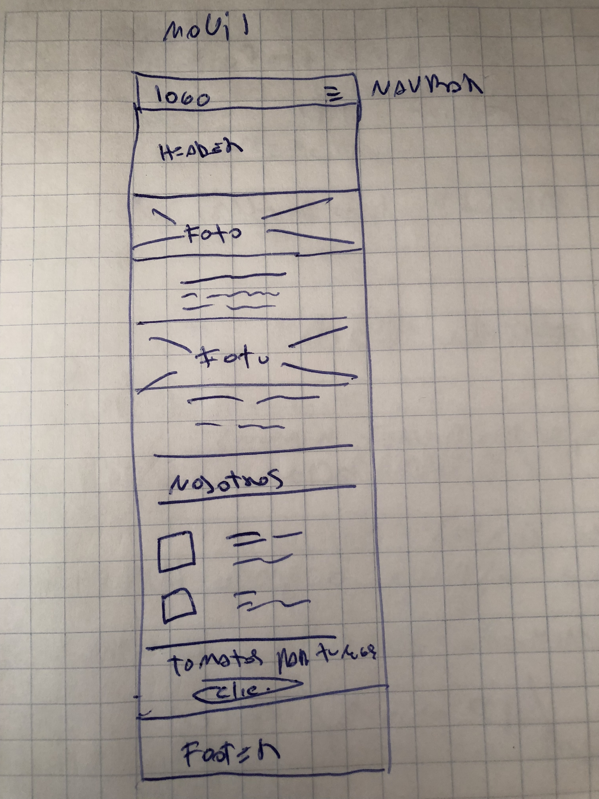
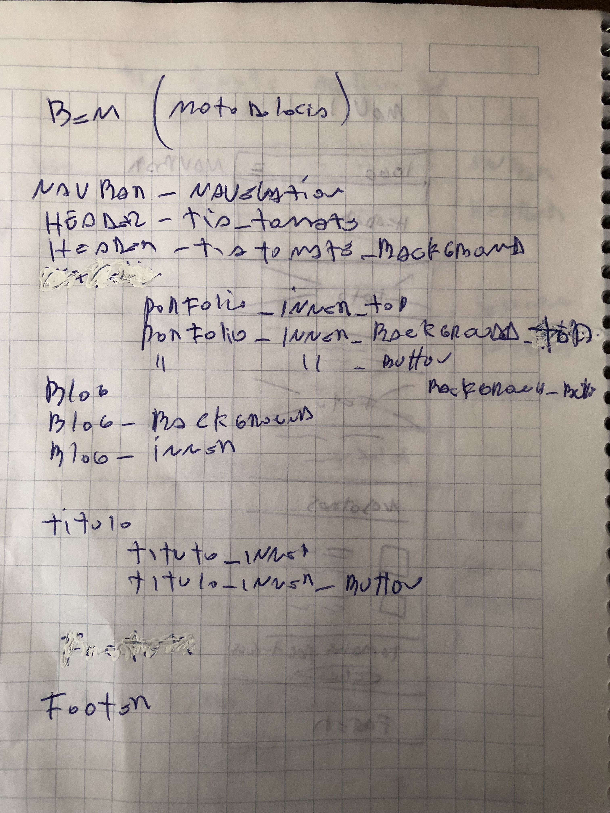

- Requisitos Generales:
    - Una  página web "acerca de Tia Tomate" contiene:
        una barra de navegacion y un footer.
        Secciones: La primera, es la seccion de header o cabecera.
                   la segunda
                   la tercera
                   la cuarta
        
- Requisitos Especificos:
      - Iconos: usar repositorio de Font-Awesome
      -Parrafos en general:
         entregagos en el mockoup
      - Secciones con grilla :usar boostrap

- Requisitos Visuales:
      - Layaout: 
         Para crear el layout usas boostrap
      - Fuentes:(buscar en google fonts)
         Titulos: Raleway-Bolt Raley-Extralight
         Parrafos y otros:Opensans-regular
      - Colores:   
         Botones y background de iconos:
         barra de navegacion #FFFFFF
         Footer:#686963
      - Imagenes:
         las imagenes se encuentras dentro de la carpeta entregada por el cliente
      - Iconos:
         para buscar iconos similares al mockup usar Font-Awesome

- sketch de la versión escritorio y móvil.

 

- ESTRUCTURA DE DIRECTORIO DEL PROYECTO

      /carpeta_proyecto 
            /assets
                  /css
                  /js
                  /img 
                  /fonts
            index.html

- DEPENDENCIAS AL PROYECTO

      <!-- Google Fonts | OpenSans & Raleway fonts -->
      <link href="https://fonts.googleapis.com/css?family=Open+Sans|Raleway:200" rel="stylesheet">
      <!-- Main Styles -->
      <link rel="stylesheet" href="assets/css/style.css">

      <!-- jquery -->
      
      <!-- Latest compiled and minified JavaScript -->
      
      <!-- Font Awesome 5 -->
      
      <!-- Main scripts -->
      
            

